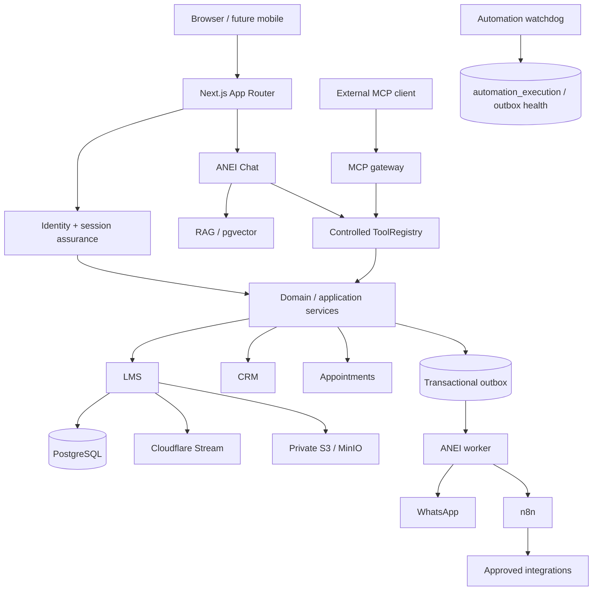

# ANEI v4 architecture

## System context and trust boundaries

ANEI is a modular monolith. Next.js owns the browser experience and HTTP boundary; Better Auth plus ANEI assurance owns identity; domain services own authorization and business transitions; PostgreSQL owns durable state. Redis is an optional bounded accelerator. The outbox worker is the only asynchronous delivery authority. n8n, MCP, the LLM, and RAG are adapters and never business authorities.

Trust is re-established at every HTTP, MCP, worker, and n8n boundary. Browser identifiers select a target only; server-side membership, entitlement, role, persona, and assurance checks grant access. Provider errors and secrets never cross the client boundary.

## Frontend route architecture

- `(site)` owns the public institutional header/footer and public URLs.
- `(auth)` owns the minimal login, registration, recovery, assurance, invitation, and review shell.
- `(learner)` owns the authenticated learner shell and dashboard. It does not render or hydrate public navigation.
- `admin` owns the separate operational console.
- Existing teacher, parent, AVS, specialist, and organization portals remain public-group children pending a dedicated staff-shell milestone; their server-side persona layouts remain authoritative.

Route groups do not alter external localized URLs.

## Authentication and assurance

Better Auth owns primary sessions and OAuth accounts. ANEI assurance is checked server-side before protected application access. Admin authorization bypasses the short cookie cache and re-reads role state. Redirects are locale-scoped and constrained by the safe redirect helper. OTP and recovery state is stored in PostgreSQL; Redis is not authoritative.

## Domain and application architecture

Route handlers validate origin, authentication, bounded input, and rate limits, then call existing services. Services enforce state transitions and use transactions for mutations plus audit/outbox writes. Database constraints are the final invariant layer.

## Course content and storage

- PostgreSQL: course/module/lesson metadata, localized text, enrollment, progress, assessments, and certificate eligibility.
- Cloudflare Stream: private video; ANEI checks entitlement and returns short-lived provider playback authorization. Next.js does not proxy video bytes.
- Private S3/MinIO: documents, resources, lesson assets, and generated certificates; ANEI checks entitlement before signing a short-lived object URL.
- pgvector: rebuildable derived embeddings only. Deleting vectors must not break LMS content.

The current schema has no publish-version model. Live-content mutation risk must be assessed and a minimal `course_version` draft/published design approved before a migration; this milestone does not introduce a speculative CMS.

## RAG and AI

Production retrieval uses `PgVectorRetriever`; the in-memory store is test-only. `PUBLIC` and `PLATFORM` documents are available under authenticated platform policy. `ORGANIZATION` requires an explicit organization context and a current ACTIVE membership checked by the retriever. `PRIVATE` remains disabled because no ownership model exists. Retrieved text is delimited as untrusted data.

The internal chat calls RAG and ToolRegistry directly, never MCP. ToolRegistry remains an allowlist and each tool re-authorizes. The OpenAI-compatible provider uses strict function schemas and returns structured arguments; registry Zod schemas validate again before authorization/execution. The bounded text parser is a compatibility fallback only for providers without structured-call support. Business writes create a confirmation-bound proposal; sensitive operations are not auto-executed. Provider failures return a safe code plus request ID.

## MCP

MCP is an external adapter to the same canonical ToolRegistry, with service/browser authentication, origin validation, scopes, rate limits, and tool allowlists. The former parallel `mcp/registry.ts` has been removed and an import-path guard prevents its return. MCP has no SQL, shell, arbitrary HTTP, role mutation, or workflow-selection authority.

## Outbox, n8n, and failure boundaries

Business transactions insert a minimal allowlisted outbox event atomically. The worker claims events with leases and `SKIP LOCKED`, applies bounded retries, and records terminal failure. Automation execution is authoritative in ANEI: n8n must atomically claim before work and can only finalize `RUNNING` executions. Duplicate delivery is expected and guarded by idempotency keys and conditional transitions.

n8n uses a separate database and credentials, a localhost-only editor in development, pinned version, protected webhooks, and a dangerous-node denylist. It never accesses ANEI or Better Auth tables directly. External side effects are not assumed exactly-once unless the provider supplies idempotency.

## Deployment and runtime

CI and development target Node 22. Next derives tracing and Turbopack roots from `process.cwd()`. PostgreSQL, Redis, Mailpit, and optional MinIO/n8n run as local dependencies. Production uses managed/private equivalents, TLS termination, secret injection, migrations before app rollout, a separate outbox worker, and health-based startup.

Mandatory failures (database, invalid environment) fail clearly. Redis degradation retains a stricter bounded in-process fallback for OTP, recovery, MCP service authentication, and internal automation authentication. Provider failures are isolated behind timeouts and safe errors. The worker's ANEI-side watchdog uses configurable DISPATCHED/RUNNING SLAs, moves stale executions monotonically to `WORKFLOW_FAILED`, and distinguishes operator-retryable unclaimed dispatches from uncertain running outcomes that must never be blindly retried.
